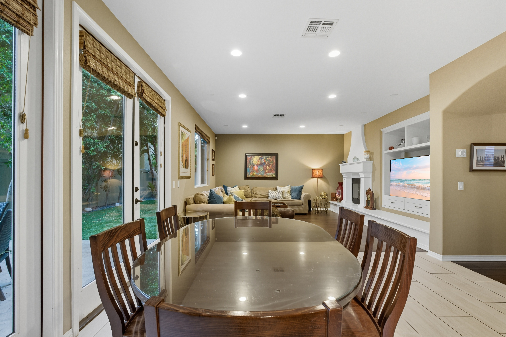
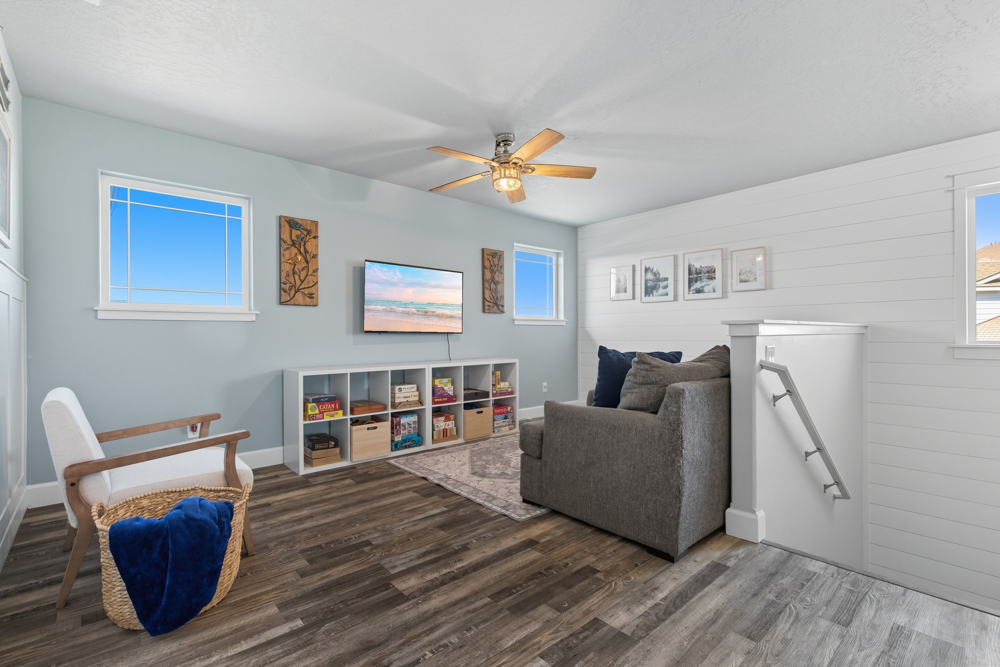

# replaceTV

Replaces the screen content of TVs in photographs with a custom overlay image. Given an input photo and a replacement image, the pipeline locates the TV screen with sub-pixel precision and composites the replacement onto it with correct perspective.

## Examples

| | |
|---|---|
|  |  |

## How it works

The pipeline runs in four stages per image:

### 1. Florence-2 coarse detection

The input image is uploaded to [fal.ai](https://fal.ai) and passed through **Florence-2 large** using referring-expression segmentation with the text query `"tv"`. Florence-2 returns a coarse polygon that covers the TV region. This is intentionally cheap — it just needs to give a reliable bounding box to constrain the more expensive stage that follows.

### 2. SAM 3 TV body segmentation

**SAM 3** (Segment Anything Model 3) is called with the Florence-2 bounding box as a box prompt and `"tv"` as a text prompt. It returns up to three candidate masks; the pipeline picks the best one by checking that the mask area is a plausible fraction of the Florence-2 bounding box area (10%–150%). Masks that are implausibly tiny (noise) or larger than the bounding box (hallucination) are rejected.

The result is a pixel-accurate binary mask of the entire TV body — screen, bezel, and speaker grille.

### 3. Screen corner detection (classical CV)

This is the core of the pipeline. SAM gives us the TV body, but we need the screen quad precisely. The steps:

1. **Mask cleanup** — The SAM mask is intersected with a dilated version of the Florence-2 polygon to clip any bleed into adjacent furniture. The largest connected component near the Florence-2 centroid is kept.

2. **Local standard deviation map** — The bezel-to-screen boundary is a sharp color transition. A fast box-filter variance computation (`Var(X) = E[X²] - E[X]²`) turns this into a map where the screen border appears as a bright rectangular ring.

3. **Canny + Hough** — Edges are extracted from the std map and probabilistic Hough line segments are detected.

4. **Bucketing** — Segments are classified as horizontal (|angle| < 25°) or vertical (|angle| > 65°); diagonal segments from perspective distortion are dropped. Each group is split into top/bottom or left/right using a length-weighted median.

5. **Innermost cluster selection** — For each side, nearby parallel segments are clustered by their perpendicular offset from center. The cluster with the best ratio of total length to distance from center is chosen — this selects the screen edge rather than the outer bezel edge, since the screen is the innermost rectangle.

6. **Total least squares line fit** — A weighted TLS fit is computed for each side's chosen cluster. TLS is used instead of ordinary least squares so that near-vertical lines don't cause numerical problems.

7. **Corner intersection** — Adjacent side lines are intersected to produce four screen corners (TL, TR, BR, BL) in original image coordinates. Several sanity checks reject degenerate results: corners must be roughly inside the crop, the quad must be convex, and its area must be 10%–105% of the TV body crop area.

### 4. Perspective warp and composite

OpenCV's `getPerspectiveTransform` maps the overlay image's four corners to the detected screen corners. `warpPerspective` applies the transform, and the result is blended into the original image using the screen mask.

### Parallelism

Images are processed in a multiprocessing pool with 4 workers. Each worker calls the fal.ai APIs independently.

## Directory structure

```
replaceTV/
├── run.py                  # Entry point and CLI
├── src/
│   ├── detection.py        # Florence-2 and SAM 3 API calls
│   ├── vision.py           # Screen quad detection and compositing
│   └── pipeline.py         # Per-image orchestration
├── download_images.py      # Fetches source images from S3
├── input_images/           # Source photos (TVs to process)
├── output_images/          # Composited results
├── debug_output/           # Per-image debug frames (--debug mode)
├── image.jpg               # Default overlay image
├── requirements.txt
└── flake.nix
```

## Setup

### Prerequisites

You need a [fal.ai](https://fal.ai) API key:

```bash
export FAL_KEY=your_key_here
```

### Option A: Nix flake (recommended)

```bash
nix develop          # enters a shell with Python 3.12 + all deps
# or
nix run .            # runs with default input_images/ → output_images/
```

`fal-client` is not yet in nixpkgs; the flake installs it automatically to a local prefix on first run.

### Option B: Docker

```bash
FAL_KEY=your_key_here docker compose up
```

Input images are read from `./input_images/` and results are written to `./output_images/` on your host. The overlay (`image.jpg`) is baked into the image at build time; to use a different overlay, add `--overlay /path/to/overlay.jpg` via a `command:` override in `docker-compose.yml`.

### Option C: pip

```bash
pip install -r requirements.txt
```

## Running

```bash
python run.py --input_dir ./input_images --output_dir ./output_images
```

Key flags:

| Flag | Default | Description |
|------|---------|-------------|
| `--input_dir` | _(required)_ | Directory of source images (jpg/png/webp/bmp) |
| `--output_dir` | _(required)_ | Directory for composited output images |
| `--overlay` | `image.jpg` | The replacement image to paste onto screens |
| `--debug` | off | Save intermediate debug frames and print raw API responses |

Debug mode writes numbered intermediate images to `debug_output/<stem>/` showing each stage: the Florence-2 box, the SAM mask, the local std map, Canny edges, raw Hough segments, and the final detected quad.

## Downloading the test dataset

Source images are stored in a public S3 bucket:

```bash
python download_images.py --output_dir ./input_images
# or limit to a subset:
python download_images.py --output_dir ./input_images --limit 20
```

Only `*src*` files are downloaded; `*tar*` files (reference composites) are skipped.
